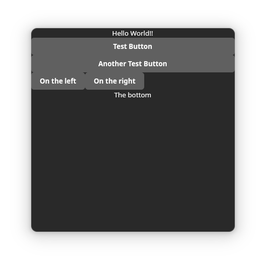

> [!WARNING]  
> This repository is undergoing significant rework. The current build instructions work but can not remain as is for the vision I have for this project.

# React Native on Linux
An experiment on controlling libadwaita UIs using React & React Reconciler

## Build
Build scripts are included in package.json but they require these native system dependencies:

- javascriptcore-6.0
- libadwaita-1
